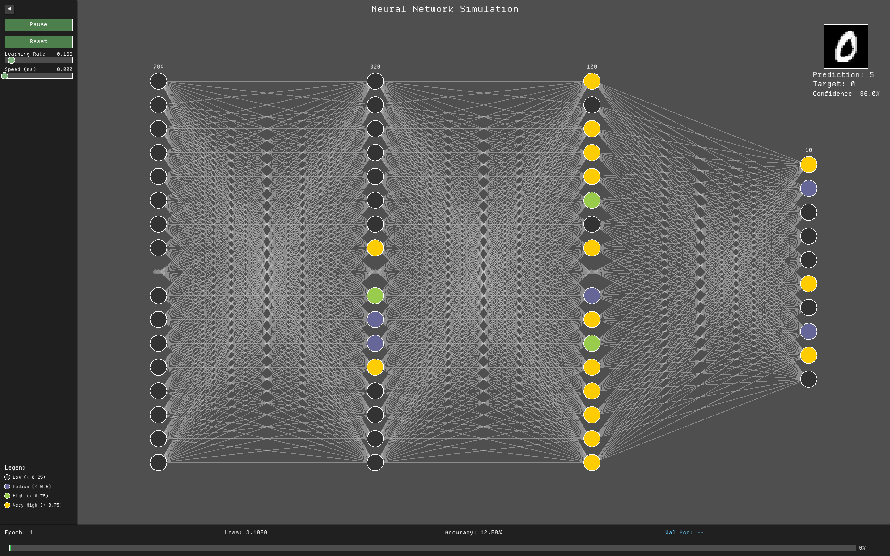

# Neural Network in Rust

A lightweight, from-scratch Neural Network library implemented in Rust, featuring a built-in real-time interactive GUI visualizer built with [Macroquad](https://macroquad.rs/). 

Watch the network learn the MNIST dataset in real-time with color-coded neuron activations, and control the training dynamically through the UI.



## Features

- **From-Scratch Implementation:** Neural network core built entirely in Rust without relying on heavy external deep learning frameworks. Features dense layers, Tanh/Sigmoid activations, MSE/CCE cost functions, and backpropagation.
- **Real-Time Visualization:** See the learning process unfold. Neurons are color-coded based on their activation levels.
- **Interactive GUI:** 
  - Pause and resume training at any time.
  - Dynamically adjust the learning rate via a slider.
  - Control training speed to closely inspect the learning process.
  - Reset the network to start over.
- **Multithreaded Architecture:** Training runs smoothly in a background thread, communicating with the main thread via MPSC channels, ensuring the UI remains responsive and fluid.
- **CLI Configurability:** Highly customizable through command-line arguments (topology, batch size, epochs, etc.).
- **Model Serialization:** Save and load trained models using JSON (`serde`).

## Getting Started

### Prerequisites

- [Rust](https://rustup.rs/) (edition 2024)
- MNIST Dataset (The `mnist-dataset` folder containing the `idx-ubyte` files should be present in the root directory).

### Installation & Building

Clone the repository and build using Cargo:

```bash
cargo build --release
```

### Usage

You can run the application directly with default settings:

```bash
cargo run --release
```

#### Command Line Arguments

Rust-NN is highly configurable via CLI arguments:

```text
Options:
  -t, --topology <TOPOLOGY>...  Network layer sizes [default: 784 320 100 10]
  -w, --screen-width <WIDTH>    Initial screen width [default: 1440.0]
  -e, --screen-height <HEIGHT>  Initial screen height [default: 900.0]
  -l, --learning-rate <LR>      Initial learning rate [default: 0.1]
  -b, --batch-size <SIZE>       Training batch size [default: 32]
  -E, --epochs <EPOCHS>         Number of training epochs [default: 5]
  -p, --path <PATH>             Path to save/load the model JSON file
  -h, --help                    Print help
  -V, --version                 Print version
```

**Example:**
Train a smaller network with a larger batch size and save it to `model.json`:
```bash
cargo run --release -- -t 784 128 10 -b 64 -l 0.05 -p model.json
```

## GUI Controls

- **Left Panel:** 
  - **Play/Pause:** Toggle training execution.
  - **Reset:** Re-initialize the network weights and restart training from epoch 1.
  - **Learning Rate Slider:** Adjust the learning rate on the fly.
  - **Speed Slider:** Add artificial delay (in ms) between batches to slow down the visualization.
- **Bottom Panel:**
  - Displays real-time training statistics including Epoch progress, Batch count, Loss, and Accuracy.
- **Legend:**
  - Color map explaining neuron activation intensity (Low, Medium, High, Very High).

## License

This project is licensed under the MIT License - see the [LICENSE](LICENSE) file for details.
